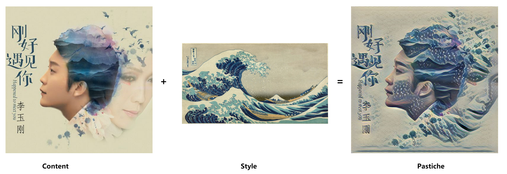
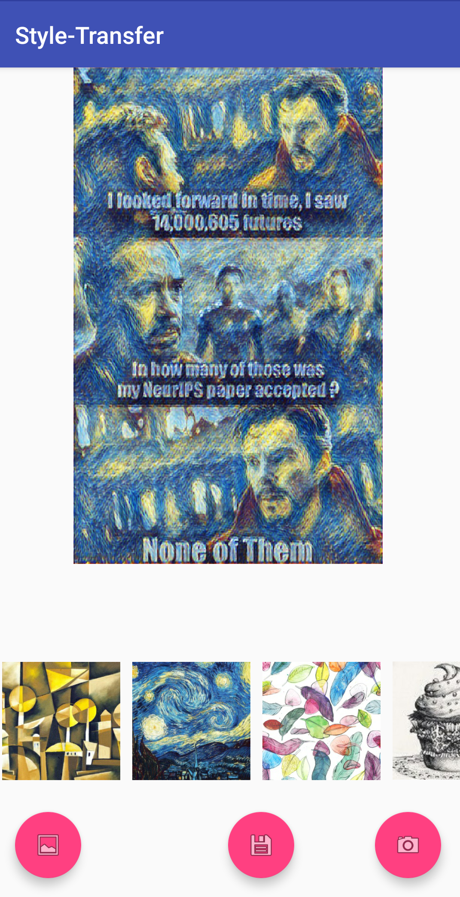

# Android-Style-Transfer
An Android app built with an artistic style transfer neural network

## Introduction
Artistic style transfer help you creat exciting image with sytle you like. It need two input images: one representing the artistic style and one representing the content.

 

This project implement style transfer on Android platfrom. It contains two parts including training style model on computer using python and deploy the model to the moblie phone with Android Studio.

The app can be download via [BaiduCloud]((https://pan.baidu.com/s/10pMQnKWoPmTdra1GovThqg))

 

## Part I. Style Model Training

### Step1. Download dataset and pretrained VGG model 
* [COCO dataset (about 12GB)](http://msvocds.blob.core.windows.net/coco2014/train2014.zips)	
* [VGG pre-trained model](http://www.vlfeat.org/matconvnet/pretrained/)	

Unzip the train2014.zip and put the folder "train2014" and "imagenet-vgg-verydeep-19.mat" to the "data" folder

### Step2. Train model
The training code refers to [@GuidoPaul](https://github.com/GuidoPaul/Android-Tensorflow-Style-Transfer)

` python style-transfer.py --style images/styles/wave.jpg --test images/test/test.jpg`  

It takes about 3 to 4 hours to train on TITAN XP.

The trained model is saved in **checkpoint** folder and the converted pb model file is saved in **model** file.

You can download the pretrained model trained by images/styled/wave.jpg via [BaiduCloud](https://pan.baidu.com/s/10pMQnKWoPmTdra1GovThqg)

### Step3. Evaluate
` python test_pb_file.py --model_name model/style_graph_frozen.pb --test_image images/test/test2.jpg`  

Run to see the input and output node and tensor size of trained model which are important for the setting on Andoird.

## Part II. Android Setup
After traning style model using python, we need deploy the trained model on android.

To run this project, you need put the pre-trained pb modol file to `Part2_Android_Project\Style_Transfer\app\src\main\assets` download via [BaiduCloud](https://pan.baidu.com/s/10pMQnKWoPmTdra1GovThqg)

To add your trained model, you need to follow these steps:

### Step1. Add style image

1. Add the style image to the folder `Part2_Android_Project\Style_Transfer\app\src\main\res\drawable`
2. Create style object to the function `initStyles()` at line **653** in **MainActivity.java**

### Step2. Add style model
1. Add the style model to the folder `Part2_Android_Project\Style_Transfer\app\src\main\assets`
2. Add this model to `pu_list` at Line **73** in **MainActivity.java**

welcome to fork and star